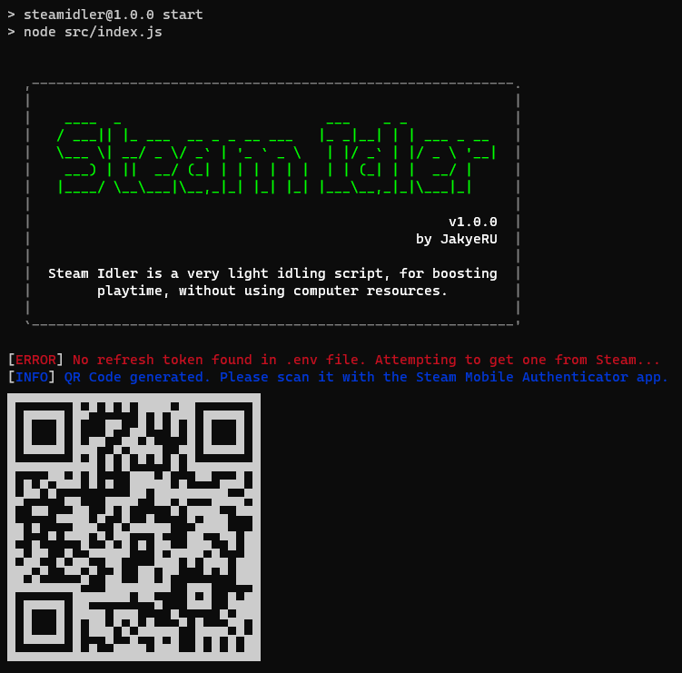

<p align="center">
    <a href="https://github.com/JakyeRU/Larascord" target="_blank">
        
    </a>
</p>

<p align="center">
    
</p>

# About Steam Idler
Steam Idler is a simple, light program that allows you to idle Steam games without having to keep the Steam client open. It is written in JavaScript and uses Node.js.

# Getting Started
## Prerequisites
- [Node.js](https://nodejs.org/en/download/)
- [Git](https://git-scm.com/downloads)
- [Steam Mobile](https://play.google.com/store/apps/details?id=com.valvesoftware.android.steam.community) (because you need to scan a QR code to log in)

## Installation
1. Clone the repository
```bash
git clone https://github.com/JakyeRU/SteamIdler.git
cd SteamIdler
```

2. Install dependencies
```bash
npm install
```

3. Run the program
```bash
npm start
```

# Usage
When running the program for the first time, you will be asked to scan a QR code. This is necessary to log in to your Steam account. After that, the program will automatically idle the game you specified in the config file.



# Configuration
The configuration file is located in `src/games.json`. You can add as many games as you want. The program will automatically idle them all.

Example:
```json
[
  381210,
  1332010,
  105600
]
```

# License
This project is licensed under the **Apache-2.0 License** - see the [LICENSE](LICENSE) file for details.
